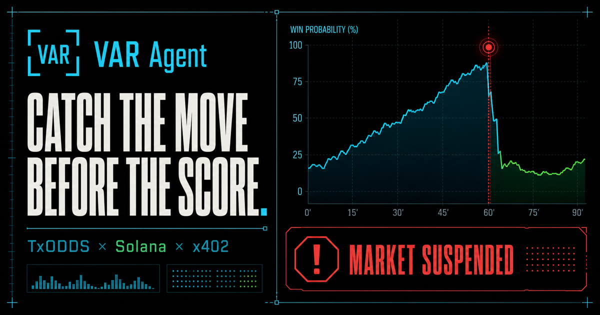

# VAR Agent

**Catch the market move before the score catches up.**

VAR Agent is an autonomous World Cup market monitor built for the TxODDS
hackathon. It watches exchange-implied probabilities for abrupt moves and
score-feed lag, emits a compact evidence packet, anchors access on Solana, and
sells the latest packet to other agents over x402.

[**Open the live MVP**](https://var-agent.vercel.app) ·
[**Watch the narrated 64-second capability demo**](https://github.com/water-bear86/var-agent/releases/download/v0.1.0/var-agent-capability-demo.mp4) ·
[**Public source**](https://github.com/water-bear86/var-agent)



## What is real in this MVP

- **Live TxODDS devnet connectivity:** `/api/feed` obtains a guest JWT and
  indexes the current fixture snapshot with an activated free-tier token.
- **On-chain access proof:** the UI links to the actual TxODDS devnet
  subscription transaction:
  [`28vVQ…C5SiJ`](https://solscan.io/tx/28vVQhFjPGiC8xx2a5tmBeJdyFSMcZ28XAVXAq8LinpTbbqkqjdDubfrjN5ZgLiTkm2qaG9RYbkvbA2hYDGC5SiJ?cluster=devnet).
- **x402 monetization:** `GET /api/signal/latest` requires exactly **0.005
  USDC** on Solana devnet before returning JSON.
- **Deterministic detector:** the 8-point/9-second probability-shock rule is
  implemented and unit tested.

The highlighted Argentina–France sequence is an explicit deterministic replay
using the TxODDS schema because the feed did not return a live odds snapshot
during the build window. It is not presented as a historical live alert, and
the access transaction proves TxODDS subscription access—not the hypothetical
match event. The product never executes a wager.

## Why it can make money

The paid output is not another consumer betting screen. It is a small,
machine-readable signal that another agent, bot, market maker, newsroom, or
risk desk can buy only when needed:

```text
GET /api/signal/latest
Price: $0.005 USDC
Network: Solana devnet
Protocol: x402 exact
```

An unpaid request receives `402 Payment Required` plus the standard
`PAYMENT-REQUIRED` header. Settlement occurs only after a successful handler
response.

## Architecture

```text
TxODDS devnet -> fixture adapter -> deterministic shock detector
                                      |
                                      +-> dashboard + evidence ledger
                                      |
                                      +-> x402 paid JSON -> USDC on Solana
```

- Next.js-compatible app compiled by
  [vinext](https://github.com/cloudflare/vinext) for the Cloudflare runtime
- TxODDS guest authentication and fixture snapshot adapter
- `@x402/next` route wrapper with the exact SVM scheme
- No database, background worker, wallet connect, or paid infrastructure
  required for the MVP

## Run locally

Requires Node.js 22.13 or newer.

```bash
npm install
cp .env.example .env.local
npm run dev
```

Set `TXODDS_API_TOKEN` to a TxODDS free-tier devnet token. `X402_PAY_TO`
defaults to the public devnet wallet used by this demo.

## Verify

```bash
npm run lint
npm test
npm audit --omit=dev

curl -i http://localhost:3000/api/signal/latest
# HTTP/1.1 402 Payment Required

curl http://localhost:3000/api/feed
```

The test suite covers the detector threshold, score-integrity behavior,
production build, server-rendered product surface, and secret non-disclosure.

## Important identifiers

- TxODDS program:
  `6pW64gN1s2uqjHkn1unFeEjAwJkPGHoppGvS715wyP2J`
- TxODDS token mint:
  `4Zao8ocPhmMgq7PdsYWyxvqySMGx7xb9cMftPMkEokRG`
- x402 settlement wallet:
  `FFCA1gAiNetensrmWbTVUhWXyh3u3KERgpH4sNUbChhw`
- Network: Solana devnet

## Safety and scope

VAR Agent is informational infrastructure, not financial advice. The MVP does
not custody funds, place bets, promise profit, or manufacture unverified live
events. Production deployment should add persistent signal history, alert
deduplication, rate limits, observability, and multiple independent score
sources.
